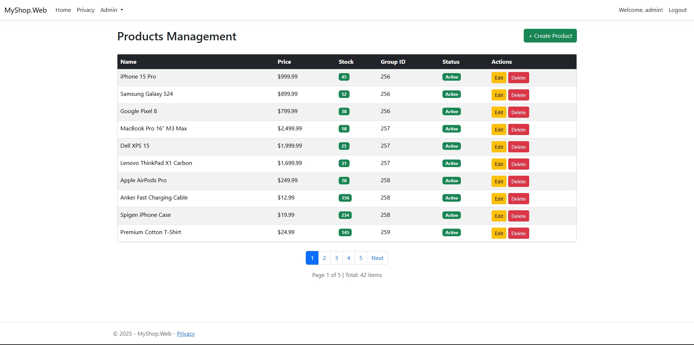
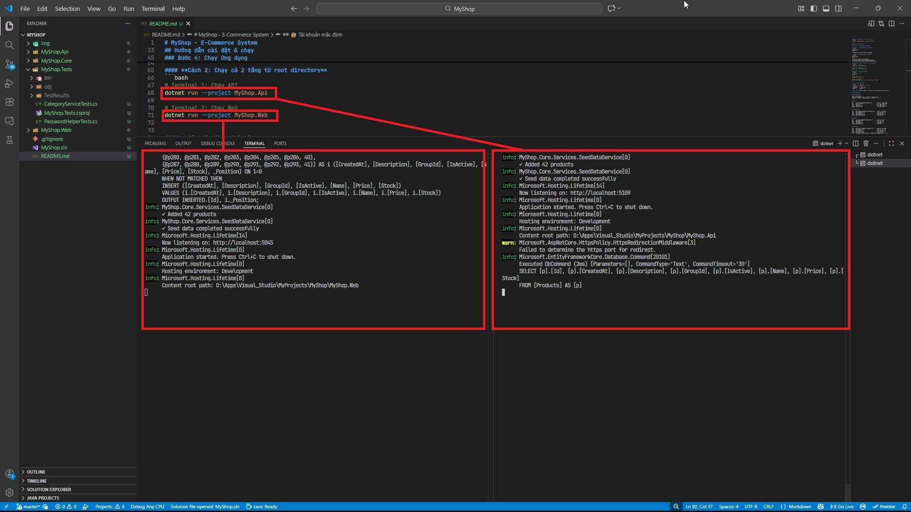
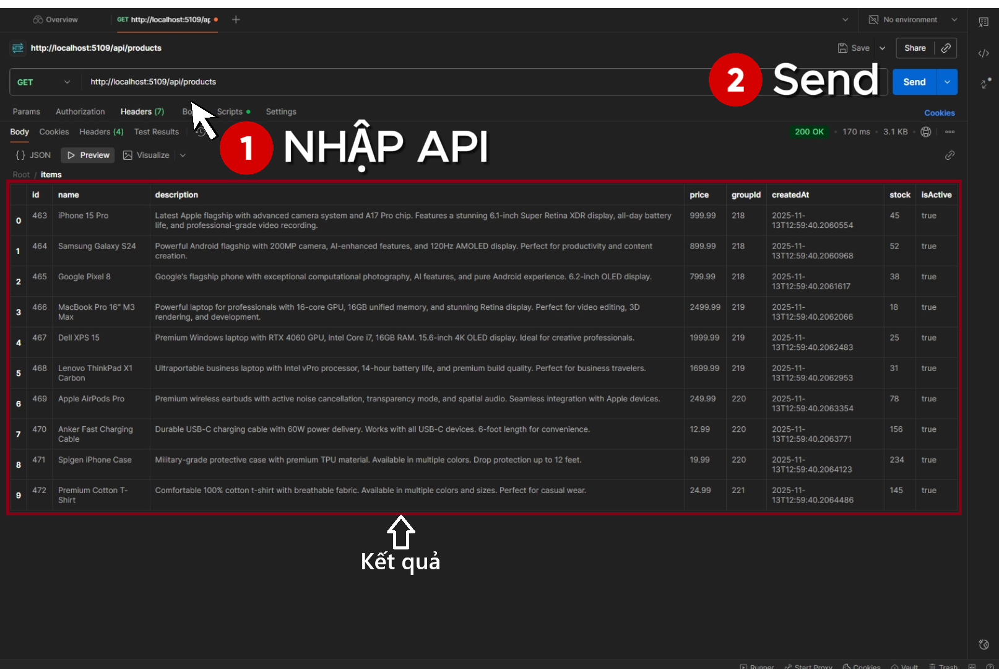

# MyShop - E-Commerce System

Hệ thống thương mại điện tử 3 tầng được xây dựng bằng ASP.NET Core 9.0 với kiến trúc phân tầng (Core, Web MVC, REST API).



## Tổng quan dự án

**Tên:** MyShop
**Mục tiêu:** Xây dựng hệ thống thương mại điện tử đơn giản với 3 tầng (Core, Web MVC, REST API).
**Công nghệ:** ASP.NET Core 9.0, EF Core, JWT, AutoMapper, Swagger.
**Cơ sở dữ liệu:** SQL Server
**Mô hình:** 3-tier architecture + Repository + Service pattern.

## Công nghệ sử dụng

- **Framework:** ASP.NET Core 9.0
- **ORM:** Entity Framework Core 9.0
- **Database:** SQL Server (LocalDB)
- **Authentication:** JWT (API), Cookie (Web)
- **Password Hashing:** BCrypt.Net-Next 4.0.3
- **Mapping:** AutoMapper 13.0.1
- **Documentation:** Swagger/OpenAPI

## Hướng dẫn cài đặt & chạy

### Yêu cầu hệ thống
- .NET 9.0 SDK trở lên
- SQL Server Express hoặc LocalDB
- Visual Studio 2022 / VS Code (tuỳ chọn)

### Bước 1: Clone/Mở dự án
```bash
git clone https://github.com/dxtruong16a4/my-shop-LTDUDN.git
```

### Bước 2: Khôi phục dependencies
```bash
dotnet restore
```

### Bước 3: Cập nhật cơ sở dữ liệu (nếu cần)
```bash
dotnet ef database update --project MyShop.Api
```

### Bước 4: Chạy ứng dụng

#### **Cách 1: Chạy riêng từng tầng**

**Terminal 1 - Chạy REST API (port 5109)**
```bash
cd MyShop.Api
dotnet run
```
✅ Swagger UI: http://localhost:5109/swagger

**Terminal 2 - Chạy MVC Web (port 5045)**
```bash
cd MyShop.Web
dotnet run
```
✅ Trang chủ: http://localhost:5045
✅ Admin Dashboard: http://localhost:5045/Users
✅ Tìm kiếm sản phẩm: http://localhost:5045/Products

#### **Cách 2: Chạy cả 2 tầng từ root directory**
```bash
# Terminal 1: Chạy API
dotnet run --project MyShop.Api

# Terminal 2: Chạy Web
dotnet run --project MyShop.Web
```



#### **Cách 3: Chạy Unit Tests**
```bash
# Chạy tất cả tests
dotnet test

# Chạy tests cụ thể
dotnet test MyShop.Tests

# Chạy với coverage
dotnet test MyShop.Tests --collect:"XPlat Code Coverage"
```

## 🔐 Tài khoản mặc định

| Trường       | Giá trị           |
| ------------ | ----------------- |
| Username     | `admin`           |
| Password     | `Admin@12345`     |
| Role         | Admin             |

**Lưu ý:** Tài khoản này được tạo tự động khi ứng dụng khởi động lần đầu tiên.

## API Endpoints

### Authentication
```
POST /api/auth/login
Body: { "username": "admin", "password": "Admin@12345" }
Response: { "token": "jwt_token_here", "userId": "...", ... }
```

### Users
```
GET    /api/users?pageNumber=1&pageSize=10          # Danh sách người dùng
GET    /api/users/{id}                              # Chi tiết người dùng
POST   /api/users                                   # Tạo người dùng
PUT    /api/users/{id}                              # Cập nhật người dùng
DELETE /api/users/{id}                              # Xóa người dùng
```

### Categories
```
GET    /api/categories?pageNumber=1&pageSize=10     # Danh sách danh mục
GET    /api/categories/{id}                         # Chi tiết danh mục
POST   /api/categories                              # Tạo danh mục
PUT    /api/categories/{id}                         # Cập nhật danh mục
DELETE /api/categories/{id}                         # Xóa danh mục
```

### Groups
```
GET    /api/groups?pageNumber=1&pageSize=10         # Danh sách nhóm
GET    /api/groups/{id}                             # Chi tiết nhóm
POST   /api/groups                                  # Tạo nhóm
PUT    /api/groups/{id}                             # Cập nhật nhóm
DELETE /api/groups/{id}                             # Xóa nhóm
```

### Products
```
GET    /api/products?pageNumber=1&pageSize=10       # Danh sách sản phẩm
GET    /api/products/{id}                           # Chi tiết sản phẩm
POST   /api/products                                # Tạo sản phẩm
PUT    /api/products/{id}                           # Cập nhật sản phẩm
DELETE /api/products/{id}                           # Xóa sản phẩm
GET    /api/products/search?keyword=...&pageNumber=1&pageSize=10  # Tìm kiếm
```

## Kiểm thử với Postman

### 1. Import Collection
- Mở Postman
- Chọn "Import" → "Raw text"
- Dán cURL hoặc JSON từ Swagger

### 2. Đăng nhập lấy Token
```
POST http://localhost:5001/api/auth/login
Content-Type: application/json

{
  "username": "admin",
  "password": "Admin@12345"
}
```

### 3. Sử dụng Token trong request
Thêm header:
```
Authorization: Bearer <token_từ_response_trên>
```

### 4. Kiểm thử Endpoints
- Test GET: Danh sách users, categories, groups, products
- Test POST: Tạo người dùng, danh mục, sản phẩm
- Test PUT: Cập nhật dữ liệu
- Test DELETE: Xóa với xác nhận
- Test Pagination: Thêm `?pageNumber=1&pageSize=5` vào query



## Swagger Documentation

API documentation tự động có sẵn tại:
```
http://localhost:5001/swagger/index.html
```

Tính năng:
- ✅ Xem tất cả endpoints
- ✅ Kiểm thử trực tiếp trong Swagger UI
- ✅ Xác thực JWT (nút "Authorize")
- ✅ Xem response schema chi tiết

## Bảo mật

### Password
- ✅ Được mã hóa bằng BCrypt
- ✅ Không bao giờ lưu dưới dạng plaintext
- ✅ Hash độc lập, không thể reverse

### JWT Token
- ✅ Chứa UserId, Username, Email, Role
- ✅ Ký với secret key từ `appsettings.json`
- ✅ Hết hạn sau 24 giờ

### Authorization
- ✅ `[Authorize]` - Chỉ người dùng đăng nhập
- ✅ `[Authorize(Roles="Admin")]` - Chỉ admin
- ✅ `[AllowAnonymous]` - Công khai (search products)

## File cấu hình quan trọng

### appsettings.json (Web)
```json
{
  "ConnectionStrings": {
    "DefaultConnection": "Server=.;Database=MyShopDb;Trusted_Connection=true;"
  },
  "DefaultAdmin": {
    "Username": "admin",
    "Email": "admin@myshop.com",
    "Password": "Admin@12345"
  }
}
```

### appsettings.json (API)

- Dùng lệnh terminal để tạo SecretKey có độ dài tối thiểu 32 ký tự
```bash
openssl rand -base64 32
```

- Sau đó paste vào phần "SecretKey" bên dưới:

```json
{
  "Jwt": {
    "SecretKey": "your-secret-key-here-min-32-chars",
    "Issuer": "MyShop",
    "Audience": "MyShop-Users",
    "ExpirationMinutes": 1440
  }
}
```

## Troubleshooting

### Lỗi: "Database connection failed"
- Kiểm tra SQL Server/LocalDB đang chạy
- Kiểm tra connection string trong appsettings.json
- Chạy: `dotnet ef database update`

### Lỗi: "401 Unauthorized"
- Token JWT có thể đã hết hạn
- Đăng nhập lại để lấy token mới
- Kiểm tra header Authorization: `Bearer <token>`

### Lỗi: "403 Forbidden"
- Tài khoản không phải admin
- Chỉ admin mới có thể truy cập quản trị
- Kiểm tra Role trong token JWT

### Web MVC không kết nối được API
- Kiểm tra API đang chạy trên đúng port
- Kiểm tra appsettings.json có đúng API base URL
- Kiểm tra firewall/proxy settings

## 📄 Giấy phép

Dự án này được tạo cho mục đích học tập.

## 👨‍💻 Tác giả

Xây dựng bằng ASP.NET Core 9.0 theo mô hình 3-tier architecture.
